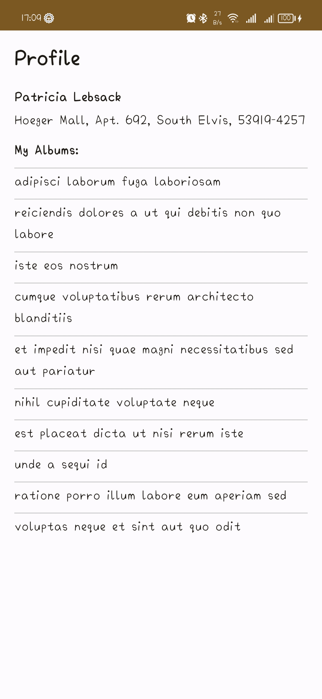
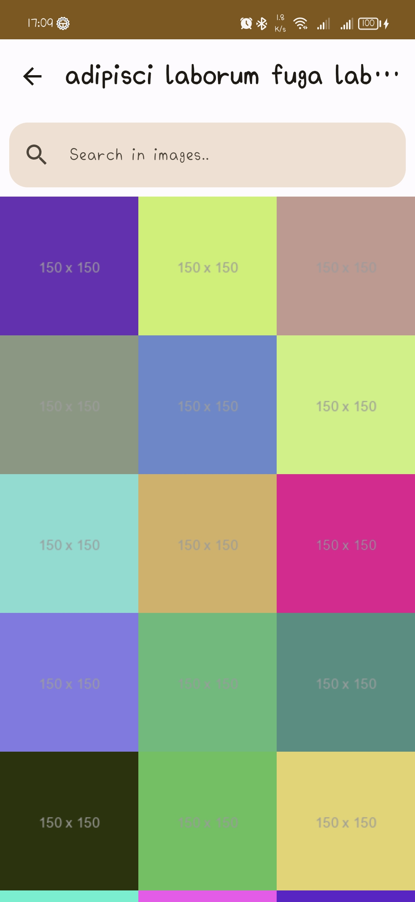

# Albums
Albums is a native Android mobile application that uses Kotlin Programming Language to get your pictures from fake API.

## Application Features:
* Get user's albums.
* Browse albums' images.
* Share your images on social media.

## Tools used
* Kotlin.
* Jetpack Compose.
* Material Design 3.
* Retrofit.
* Hilt Dependency Injection.
* Coroutines.
* MVVM Design Pattern.

## Downloads
[APK Download](https://drive.google.com/file/d/1Ls25b-Nt0aDYyZMaYvo0vplmiqifbBFL/view?usp=sharing)

## Screenshots

  
  

